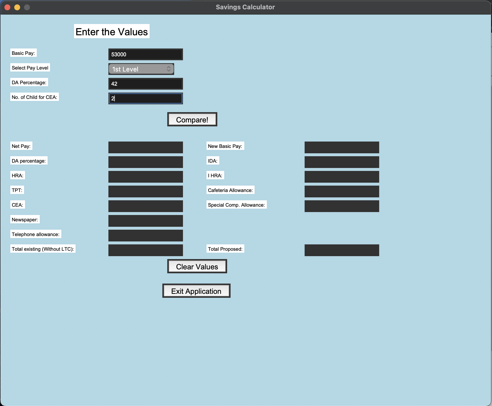

# GUI-Based-Salary-Calculator
GUI Salary Calculator - My first project from OLF vocational training

# 💰 Salary Calculator - OLF Vocational Training Project


A GUI-based salary calculator developed during my summer vocational training at Opto Electronics Factory (OLF) after 1st year of B.Tech CSE.

## 📖 Project Background

This was my **first ever programming project** created during vocational training at OLF. As a first-year engineering student, I taught myself Java concepts and GUI development to create this salary calculator that performs real-time calculations without using databases.

**Key Challenge**: Connecting backend calculations with frontend GUI was a major learning experience at that time.

## ✨ Features

- Real-time salary calculations
- GUI built with Tkinter
- No database required
- Calculates various components:
  - Basic Pay + DA (Dearness Allowance)
  - HRA (House Rent Allowance)
  - CEA (Child Education Allowance)
  - TPT, IDA, and other allowances
  - Net pay comparison

## 🛠️ Technologies Used

- **Python** with Tkinter for GUI
- **Backend**: Pure Python calculations
- **Frontend**: Tkinter widgets

## 📸 Screenshots

### Full Application View


### Main Interface


### Calculation Results


## 📸 Screenshots


## 🎯 Learning Outcomes

This project was a significant learning experience that helped me develop:

- **GUI Application Development**: Learned to create desktop applications with Tkinter
- **Frontend-Backend Integration**: Successfully connected user interface with calculation logic
- **Tkinter Framework**: Mastered Python's built-in GUI toolkit and widget management
- **Real-time Calculations**: Implemented instant computation without database dependency
- **Problem-solving in Unfamiliar Codebase**: Adapted to and understood existing Java code to create a Python solution

## 🤝 Contribution

This project is maintained as a historical record of my first programming endeavor. The code is preserved in its original form to showcase my learning journey and growth as a developer.

*Note: The code remains unmodified to maintain its authenticity as my first project.*

---

*Created with 💻 during Summer Vocational Training at Opto Electronics Factory (OLF) (MoD, Govt. of India)*

## 🚀 How to Run

1. Ensure you have Python installed
2. Run the script:
```bash
python salary_calculator.py
